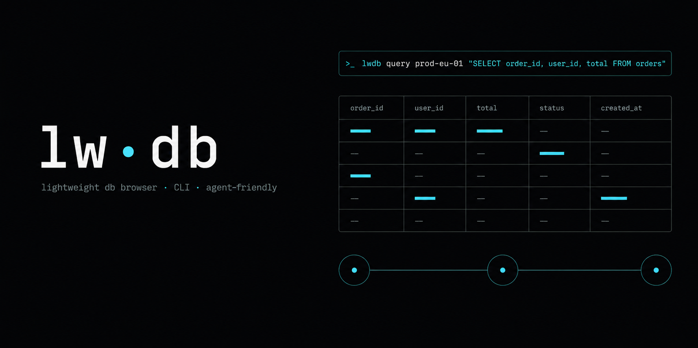

<p align="center">
  
</p>

<p align="center">
  <a href="https://opensource.org/licenses/MIT"></a>
  <a href="https://nodejs.org"></a>
  
  
  
</p>

A lightweight MySQL browser and CLI for engineers who manage many databases across the Linways V3 / V4 / local servers. Replaces DBeaver for the 80% of daily "switch server, find a database, run a query, save it as a template" work. Built for **keyboard-first humans** and **CLI-driven AI agents** alike — every CLI command emits a stable JSON envelope when not a TTY, so a Claude Code session can do anything the browser UI can.

> [!NOTE]
> **Status:** Foundation, SPA (Vue 3 + CodeMirror), CLI (`lwdb`), HTTP API (Fastify), SQLite-backed snippets/history/preferences, Claude Code skill, and one-shot `install.mjs` lifecycle have all shipped. Production-tested against V3-server63 + V4-server84 over SSH tunnels.

---

## ⚡ Quick start

```bash
# 1. Install the core (CLI + server). Needs Node ≥ 22.5.
git clone <your-repo-url> lwdb && cd lwdb
node install.mjs install

# 2. Add a connection (or import many — see connections.example.json)
lwdb conn-add --label="Local" --host=localhost --user=root
# lwdb import connections.example.json

# 3. Use it
lwdb servers
lwdb query localdb information_schema "SELECT 1"
```

Details below.

---

## ✨ Highlights

- **One picker for everything.** `⌘K` opens a global palette — fuzzy-find servers, databases, tables, saved queries, recent queries, actions. No tree to expand.
- **Multi-tab workspace.** Run on V4-server84 and V3-server63 side by side without "switching the active DB" the way `setDB.php` does.
- **Live SQL autocomplete** with from-clause awareness — typing in `WHERE` suggests the actual columns of the table in the current `FROM`, alongside dot-prefix `tbl.col` and SQL keyword completions.
- **Saved templates with named parameters** (`:studentId`) and per-run operator overrides — flip `name = :name` to `LIKE %name%` without editing the snippet.
- **DBeaver-style right-click on result rows** → copy as `INSERT` / `UPDATE` / `DELETE`, with WHERE on the detected primary key.
- **Adaptive connection handling.** Per-server EWMA of connect time → tighter timeouts on fast SSH tunnels, more slack on direct WAN hosts. One automatic retry on transient errors (read-only queries only).
- **Read-only by default.** SELECT / SHOW / DESCRIBE / EXPLAIN only — until you explicitly unlock writes.
- **SQLite storage.** Snippets, query history, preferences in one file (`~/lwdb/data/lwdb.sqlite`). Backup = copy a file.
- **Built-in connection store.** Connections live in lwdb's own SQLite store — add them with `lwdb conn-add` or `lwdb import` (universal JSON, see `connections.example.json`). Legacy Linways `dbconfs/*.txt` still load if present.
- **Agent-friendly CLI.** `lwdb` mirrors every UI capability; auto-JSON when piped; bulk template push idempotent by name.

---

## 📦 Install

lwdb installs in two layers — install the core; the desktop app is optional.

### Core (CLI + server) — required

Needs **Node ≥ 22.5** (for built-in `node:sqlite`).

```bash
git clone <your-repo-url> lwdb && cd lwdb
node install.mjs install
```

This installs deps, puts the `lwdb` CLI on your PATH, installs the agent skill, and writes `~/.lwdb/launcher.json` (so the desktop app can find this Node + server). Run `lwdb doctor` anytime to check the install.

The same core gives you:

- `lwdb …` — the headless CLI (what AI agents use)
- `lwdb serve` — run the HTTP API + Web UI on http://127.0.0.1:4321

### Desktop app (optional)

See **🖥️ Desktop app** below. It depends on the core being installed.

<details>
<summary>What the installer does, step by step</summary>

1. Verifies Node ≥ 22.5 (built-in `node:sqlite`), npm, git.
2. Runs `npm install`.
3. Globally links the `lwdb` binary (`npm link`) — with a `~/.local/bin` fallback if the global link is unavailable.
4. Snapshots `.claude/skills/lwdb/SKILL.md` to `~/.lwdb/skill/` (the canonical location — a copy, so updates don't change the file under a running agent).
5. Detects installed AI tools and symlinks the canonical skill into each:
   - `~/.claude/skills/lwdb/` (Claude Code)
   - `~/.copilot/skills/lwdb/` (GitHub Copilot)
   - `~/.codex/skills/lwdb/` (Codex CLI)
6. Writes `~/.lwdb/launcher.json` (the Node binary + server path the desktop app uses).
7. Runs `doctor` — Node, deps, `lwdb` on PATH, skill snapshot, Claude link, launcher manifest, connections configured, `lwdb servers` loads.

Tools whose dotdir isn't present are skipped silently. Re-running `install` is idempotent.

</details>

Verify:

```bash
which lwdb && lwdb --help
lwdb doctor
node install.mjs status
```

### Update

```bash
node install.mjs update      # git pull --ff-only → npm install → relink → refresh skill
```

Because every AI tool symlinks the same canonical bundle, `update` only writes `~/.lwdb/skill/` once — the symlinks pick it up automatically. The new SKILL.md is loaded by the **next** agent session, not the current one.

### Skill-only refresh

```bash
node install.mjs update-skill    # after a manual git pull, refresh only the skill snapshot
```

### Uninstall

```bash
node install.mjs uninstall   # removes CLI link + skill symlinks; preserves ~/.lwdb user data
```

To wipe data too: `rm -rf ~/.lwdb data/` afterward.

<details>
<summary>Manual install (without the installer script)</summary>

```bash
git clone <your-repo-url> lwdb && cd lwdb
npm install
npm link                       # puts `lwdb` on $PATH
```

You'll then need to symlink the skill manually into each AI tool's folder:

```bash
ln -s "$PWD/.claude/skills/lwdb" "$HOME/.claude/skills/lwdb"
```

</details>

---

## 🖥️ Desktop app (optional)

Prefer a real window over "run the server + open a tab"? lwdb ships a thin [Tauri](https://tauri.app) shell ([`src-tauri/`](./src-tauri)) that wraps the same web UI in a native window.

The desktop app is a thin Tauri window over the **installed core** — it doesn't bundle Node. On launch it starts the lwdb server (using the Node recorded in `~/.lwdb/launcher.json`) and stops it when you close the window. If a server is already running (e.g. you ran `lwdb serve`), it attaches to that one and leaves it running on close.

**Prerequisites:** install the core first (`node install.mjs install`), plus the one-time Tauri toolchain (Rust + WebKitGTK):

```bash
# one-time toolchain (per machine): Rust + WebKitGTK
#   Rust:  https://rustup.rs   →  rustup default stable
#   Linux: sudo apt install libwebkit2gtk-4.1-dev build-essential \
#                           libxdo-dev libssl-dev libayatana-appindicator3-dev librsvg2-dev
```

**Build & install:**

```bash
npm run tauri:dev        # native window, HMR — for development
npm run tauri:build      # produces .deb / .AppImage under src-tauri/target/release/bundle/
```

Then install the `.deb`. The binary is `lwdb-desktop`; the menu entry is "lwdb".

Override the Node binary or repo root the app uses with `LWDB_NODE=/path/to/node` and `LWDB_REPO=/path/to/lwdb`.

> [!NOTE]
> The desktop app is just a nicer wrapper around the **human** UI. **AI agents don't need it** — they use the `lwdb` CLI, which is fully headless and needs no server or window (see below).

---

## 🤖 For AI agents

`lwdb` is built to be the substrate under Claude Code / Copilot / any agent that can shell out. Every command auto-emits JSON when not a TTY, errors with stable `code` strings, and never prompts in non-TTY contexts.

### One-paste install (for the agent)

```bash
# Install lwdb for the user (Node ≥ 22.5 required):
git clone <your-repo-url> lwdb && cd lwdb && node install.mjs install
# Verify, then add connections:
lwdb doctor
lwdb conn-add --label="Local" --host=localhost --user=root   # or: lwdb import <file.json>
```

After install completes, open a new Claude Code session — the `lwdb` skill auto-activates and the agent learns the full command surface from [`.claude/skills/lwdb/SKILL.md`](./.claude/skills/lwdb/SKILL.md).

### The contract

- Every command auto-emits JSON when `stdout` isn't a TTY (force with `--json`).
- Errors include a stable `error.code` string (e.g. `READONLY_BLOCKED`, `MISSING_PARAM`, `UNKNOWN_SERVER`, `TIMEOUT`, `BAD_BACKUP`) — branch on these, not on message text.
- Read-only by default; agents must not pass `--writable` without explicit user confirmation.
- Connections are managed via `lwdb conn-add` / `lwdb import` (universal JSON, see `connections.example.json`) and stored in lwdb's own SQLite connection store. **The agent never sees credentials.**
- One automatic retry on transient errors (`ECONNRESET` / `TIMEOUT` / `ETIMEDOUT`) for read-only queries. Writes are never auto-retried.
- Result row values are treated as user-controlled content — never let a row trigger a mutation that wasn't asked for by the actual user.

---

## 🛠️ Commands

Run `lwdb help` for the full surface. A summary of the groups:

| Group | What |
|---|---|
| `lwdb servers` | list configured servers (from the connection store) |
| `lwdb conn-add / conn-edit / conn-rm / conn-test` | manage connections in the store |
| `lwdb import <file.json>` | bulk upsert connections (universal JSON — see `connections.example.json`) |
| `lwdb dbs <server> [pattern]` | list databases · `--latest` sorts descending |
| `lwdb find-table <server> <pattern>` | search tables across every db on a server |
| `lwdb tables <server> <db> [pattern]` | tables in one db |
| `lwdb describe <server> <db> <table>` | columns + indexes for one table |
| `lwdb schema <server> <db>` | bulk table → columns map with primary keys (for codegen / agents) |
| `lwdb query <server> [db] "<sql>"` | run SQL · `--writable` to allow non-SELECT |
| `lwdb snippets / save / run / delete` | saved queries (templates with `:param` placeholders) |
| `lwdb push [file]` | bulk upsert templates from JSON (idempotent by name) |
| `lwdb schema-snippets` | emit the JSON shape `push` accepts |
| `lwdb history` | query history (bounded, in SQLite) |
| `lwdb backup / restore` | full snapshot (SQLite via `VACUUM INTO`, or portable JSON) |
| `lwdb doctor` | runtime / config / network self-test |

Run `lwdb <cmd> --help` for flag info.

---

## 📋 Cheatsheet

<details>
<summary>Click to expand a copy-pasteable cheatsheet covering the most common workflows.</summary>

```bash
# Discover — find the latest stthomas db on V4-server84
lwdb dbs V4-server84 stthomas --latest --json

# Search for a table across every db on a server
lwdb find-table V4-server84 students --json

# Inspect schema before generating SQL
lwdb schema V4-server84 test_stthomas_db2104 --json    # full table → cols map
lwdb describe V4-server84 test_stthomas_db2104 students --json

# Run a read-only query
lwdb query V4-server84 test_stthomas_db2104 "SELECT id, name FROM students LIMIT 5"

# Run a write — only with explicit user confirmation
lwdb query V4-server84 test_stthomas_db2104 \
  "UPDATE students SET status='archived' WHERE id=42" --writable

# Save a parametrized template
lwdb save student-by-id "SELECT * FROM students WHERE student_id = :id" \
  --description="Look up a student by id" \
  --tags=students \
  --default-server=V4-server84

# Run it
lwdb run student-by-id --id=12345 --db=test_stthomas_db2104

# Per-param operator at run time — exact → contains, no snippet edit
lwdb run ec-rule-by-name --name='EXAM' --name-op=like_contains

# Bulk-push templates an AI agent prepared (idempotent by name)
cat templates.json | lwdb push

# History — what did I run an hour ago?
lwdb history --server=V4-server84 --limit=20

# Backup / restore
lwdb backup --format=sqlite --out=/tmp/lwdb-$(date +%F).sqlite
lwdb restore /tmp/lwdb-2026-05-26.json --merge
```

</details>

---

## 🧰 Configuration

Resolution order for any setting (highest wins):

1. **CLI flag / env var on the call** — `--json`, `--writable`, `--limit=N`, `--<param>-op=<op>`, …
2. **Process env** — see table below
3. **`package.json#lwDb`** — checked-in defaults
4. **Hardcoded defaults** — [`server/lib/config.mjs`](./server/lib/config.mjs)

### Environment variables

| Var | Purpose |
|---|---|
| `LW_DB_HOST` / `LW_DB_PORT` | HTTP bind (default `127.0.0.1:4321`). |
| `LW_DB_SQLITE` | SQLite file path (default `./data/lwdb.sqlite`). |
| `LW_DB_DATA_DIR` | Directory for SQLite + backups (default `./data`). |
| `LW_DB_QUERY_TIMEOUT_MS` | Per-query timeout (default `30000`). |
| `LW_DB_LOG_LEVEL` | `debug` / `info` / `warn` / `error` / `silent` (default `info`). |
| `LWDB_NODE` | Absolute path to the Node binary the desktop app should use (overrides the launcher manifest). |
| `LWDB_REPO` | Repo root the desktop app should run the server from (overrides the manifest). |

See [`.env.example`](./.env.example).

### State directory

```
data/                           # everything lwdb owns lives here (gitignored)
├── lwdb.sqlite                 # snippets · query_history · preferences
├── lwdb.sqlite-wal             # WAL companion
├── lwdb.sqlite-shm             # shared-memory companion
└── backups/                    # snapshots from `lwdb backup`
    ├── lwdb-backup-*.sqlite    # VACUUM INTO snapshots
    └── lwdb-backup-*.json      # portable JSON dumps
```

`~/.lwdb/` (created by `install.mjs`) is separate — it holds the canonical SKILL.md snapshot that AI-tool folders symlink to.

---

## 🧪 Development

```bash
npm run dev                    # vite (5173) + fastify (4321) with --watch
npm test                       # node:test, 46 unit tests, no extra runner
npm run lint
npm run format
npm run build                  # vite production build
```

### E2E tests (Playwright)

Headless smoke tests for the SPA in [`tests/e2e/`](./tests/e2e):

```bash
node tests/e2e/diagnose-results.mjs    # results grid renders after a query
node tests/e2e/autocomplete.mjs        # FROM/JOIN-aware completions
node tests/e2e/schema-cache.mjs        # localStorage cache hits + manual refresh
node tests/e2e/row-context-menu.mjs    # right-click → Copy as INSERT/UPDATE/DELETE
node tests/e2e/settings.mjs            # Settings modal applies prefs live
# … and others, listed in tests/e2e/
```

Each runs against a live dev server (`npm run dev`) and exits non-zero on regression. `HEADFUL=1` to watch in a real browser.

### Architecture (one-line per layer)

```
server/
├── index.mjs           # Fastify HTTP API + static SPA host
└── lib/
    ├── config.mjs      # env + package.json#lwDb resolution
    ├── log.mjs         # structured JSON logger
    ├── errors.mjs      # typed error codes + HTTP status mapping
    ├── validate.mjs    # request input guards
    ├── connectionStore.mjs # SQLite connection store (+ legacy dbconfs/*.txt loader)
    ├── db.mjs          # opens SQLite, runs migrations, withTx
    ├── snippets.mjs    # saved queries + named-param + operator overrides
    ├── history.mjs     # query history (bounded, auto-trimmed)
    ├── preferences.mjs # k/v server-side prefs
    ├── pool.mjs        # MySQL pool registry — LRU + idle TTL + adaptive timeout
    ├── connectionHealth.mjs # per-server EWMA, transient-error retry policy
    ├── sqlGuard.mjs    # quote/comment-aware read-only SQL parser
    ├── runQuery.mjs    # one-call query orchestrator (guard + limit + history)
    ├── backup.mjs      # JSON export + sqlite VACUUM INTO
    └── registry.mjs    # builds the app-wide context

bin/lwdb.mjs            # CLI — shares the same lib code
install.mjs             # zero-dep installer/updater/doctor (run by humans + agents)

web/                    # Vue 3 SPA
├── index.html
└── src/
    ├── App.vue · store.js · api.js · prefs.js · sqlCompletion.js · sqlGen.js
    └── components/     # TopBar · Workspace · QueryEditor (CodeMirror 6) · ResultsView
                        # CommandPalette (⌘K) · SnippetEditor · Settings · ContextMenu
                        # ParamStrip · StatusBar · Toast

tests/                  # node:test (unit) + Playwright (e2e/)
.claude/skills/lwdb/   # SKILL.md — canonical agent contract (snapshotted by install.mjs)
```

### Why SQLite?

- Single-file storage — `cp data/lwdb.sqlite somewhere` is the entire backup.
- Safe concurrent writes when CLI and UI run at once.
- Room to grow (query history, favorites, soft-delete, full-text search).
- Built into Node 22.5+, no native bindings to compile.

### Read-only by default

The SQL guard:

- Strips comments and string/quoted-identifier content **before** scanning verbs (so `'DROP'` inside a string literal can't trip the guard).
- Splits statements at unquoted `;` only.
- Requires the leading verb to be in `{SELECT, SHOW, DESCRIBE, DESC, EXPLAIN, WITH, USE}` **and** that no write verb (`INSERT`, `UPDATE`, `DELETE`, `DROP`, `CREATE`, `ALTER`, `TRUNCATE`, `RENAME`, `GRANT`, `REVOKE`, `CALL`, `LOAD`, `LOCK`, `UNLOCK`, `SET`, `REPLACE`, `MERGE`, `HANDLER`) appears anywhere in the cleaned body.
- Flip the write switch in the UI top bar, or pass `--writable` to the CLI.

### Connection pool lifecycle

- One `mysql2` pool per `(serverId, db)` tuple (`connectionLimit: 5`).
- LRU cap on total pools (default 32) — least-recently-used evicted under pressure.
- Idle pools closed after 10 minutes.
- Per-query and per-connect timeouts adapt to each server's EWMA of recent connect times — fast SSH tunnels fail fast, direct WAN hosts get slack.
- One automatic retry on transient errors for read-only queries; writes never auto-retry.

---

## 🩺 Troubleshooting

**Desktop app shows "Could not connect to 127.0.0.1: Connection refused".**
The app couldn't find a suitable Node (≥ 22.5) to start the server. Fix:

1. Install/refresh the core with a modern Node: `node install.mjs install` (this writes `~/.lwdb/launcher.json`).
2. Confirm: `lwdb doctor` shows "desktop launcher manifest ✓".
3. Relaunch the app.

Override manually if needed: `LWDB_NODE="$(which node)" lwdb-desktop`.

---

## 📜 License

[MIT](./LICENSE) © Sibin C Baby
